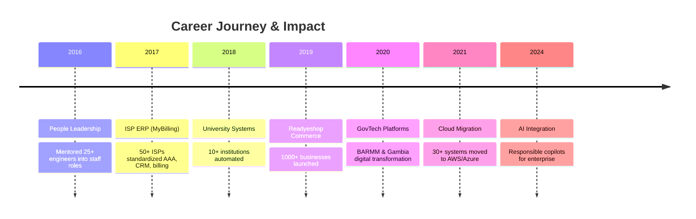

<div align="center">

<!-- Animated Header -->


<!-- Typing Animation -->
<a href="https://git.io/typing-svg"></a>

<!-- Status Badges -->
<p>
  
  
  
</p>

<!-- Social Links -->
<p>
  <a href="https://mmorshed.me"></a>
  <a href="mailto:dolardx@gmail.com"></a>
  <a href="https://www.linkedin.com/in/motakabbir-morshed"></a>
</p>

<p>
  <a href="https://youtube.com/@morshed0"></a>
  <a href="https://medium.com/@dolardx"></a>
  <a href="https://twitter.com/Motakabbir16279"></a>
</p>

<!-- Profile Views -->
<p>
  
  
  
</p>

</div>

---

<!-- About Section -->
<h2>
  
  About Me
</h2>


```typescript
const motakabbir = {
  role: "Lead Software Engineer & System Architect",
  company: "Orange Business Development Ltd",
  location: "Dhaka, Bangladesh 🇧🇩",
  
  experience: "10+ years",
  systemsDelivered: "250+",
  clientsServed: "170+",
  teamsLed: "15+",
  
  certifications: ["AWS Developer", "AWS SA", "TOGAF", "CSM"],
  
  domains: [
    "GovTech & Digital Transformation",
    "University Operating Systems", 
    "Multi-Cloud Modernization",
    "Enterprise Commerce Platforms"
  ],
  
  philosophy: "Design for trust, compliance, and measurable public impact"
};
```

<br clear="right"/>

---

<!-- Stats Dashboard -->
<h2>
  
  Impact Dashboard
</h2>

<div align="center">

<!-- Animated Stats Cards -->
<table>
<tr>
<td align="center" width="25%">
  
  <br/>
  <strong style="font-size: 28px;">10+</strong>
  <br/>
  <sub><b>Years Experience</b></sub>
  <br/>
  <sub>Platform Leadership</sub>
</td>
<td align="center" width="25%">
  
  <br/>
  <strong style="font-size: 28px;">250+</strong>
  <br/>
  <sub><b>Systems Launched</b></sub>
  <br/>
  <sub>Mission-Critical</sub>
</td>
<td align="center" width="25%">
  
  <br/>
  <strong style="font-size: 28px;">170+</strong>
  <br/>
  <sub><b>Clients Served</b></sub>
  <br/>
  <sub>Governments & Enterprises</sub>
</td>
<td align="center" width="25%">
  
  <br/>
  <strong style="font-size: 28px;">25+</strong>
  <br/>
  <sub><b>Engineers Mentored</b></sub>
  <br/>
  <sub>Into Staff Roles</sub>
</td>
</tr>
</table>

</div>

---

<!-- Current Focus -->
<h2>
  
  Currently Shipping
</h2>

<div align="center">

| Project | Mission | Progress | Status |
|:--------|:--------|:---------|:-------|
| 🏛️ **E-Gov Platform v3.0** | Unified citizen services for BARMM |  | 🚀 Launch Prep |
| 🎓 **University Automation** | Modern registrar + LMS journeys |  | ⚡ Rollout |
| 🤖 **AI Integration Module** | Responsible copilots for internal ops |  | 🛠️ Build |
| ☁️ **Cloud Migration Suite** | Multi-cloud move for legacy ERP |  | 📋 Blueprint |

</div>

---

<!-- Tech Stack -->
<h2>
  
  Tech Stack
</h2>

<div align="center">

<table>
<tr>
<td align="center" valign="top" width="33%">
  
### 🎨 Frontend
  


<br/>


</td>
<td align="center" valign="top" width="33%">
  
### ⚙️ Backend
  


<br/>


</td>
<td align="center" valign="top" width="34%">
  
### 🗄️ Data & Cloud
  


<br/>


</td>
</tr>
</table>

</div>

---

<!-- Skills Matrix -->
<h2>
  
  Expertise Matrix
</h2>

<div align="center">

```text
🎯 Technical Leadership
Architecture Reviews       ████████████████████░   95%
Quality Playbooks          ██████████████████░░░   90%
Stakeholder Alignment      ████████████████████░   95%
Team Coaching              █████████████████████  100%

💻 Full-Stack Development
Vue/Nuxt & Tailwind        █████████████████████  100%
Laravel / PHP              █████████████████████  100%
React / Next.js            ██████████████████░░░   90%
Node / Nest / Express      ██████████████████░░░   90%

☁️ Cloud & DevSecOps
AWS Landing Zones          ████████████████████░   95%
Container Orchestration    ██████████████████░░░   90%
CI/CD & GitOps             ██████████████████░░░   90%
Zero-Trust Patterns        █████████████████░░░░   85%

🔮 Exploration Frontier
Generative AI              ████████████████░░░░░   80%
Event-driven Systems       ████████████████████░   95%
Systems Design             █████████████████░░░░   85%
Web3 & Digital ID          ████████░░░░░░░░░░░░░   40%
```

</div>

---

<!-- Featured Projects -->
<h2>
  
  Spotlight Programs
</h2>

<div align="center">

<table>
<tr>
<td width="50%">

### 🏛️ LEAPS — Unified Gov Services
> **Vue.js · Laravel · AWS**

One-stop workflow digitization, citizen portals, and compliance dashboards for BARMM ministries.

<sub>✅ 500K+ citizens served via unified portals</sub>

</td>
<td width="50%">

### 🌍 Gambia GovTech Platform
> **Nuxt.js · PostgreSQL · Docker**

National service catalog, payment rails, and audit-ready records improving transparency.

<sub>✅ National-scale digital transformation</sub>

</td>
</tr>
<tr>
<td width="50%">

### 🎓 University Automation
> **React · Node.js · MySQL**

Self-service academic journeys, registrar automation, and finance desks.

<sub>✅ 10+ institutions fully automated</sub>

</td>
<td width="50%">

### 🛒 Readyeshop Commerce
> **Vue.js · Laravel · Stripe**

SaaS storefront builder with unified OMS, inventory, and payments.

<sub>✅ 1000+ businesses launched online</sub>

</td>
</tr>
<tr>
<td width="50%">

### 📡 MyBilling ISP ERP
> **PHP · Redis · Linux**

Carrier-grade billing, AAA, and CRM tied to SMS gateways + national payments.

<sub>✅ 50+ ISPs standardized operations</sub>

</td>
<td width="50%">

### 📋 Complaint Management
> **Angular · .NET · SQL Server**

Omnichannel intake and insight loops that lifted CSAT.

<sub>✅ Improved CSAT for telecom & public desks</sub>

</td>
</tr>
</table>

</div>

---

<!-- Timeline -->
<h2>
  
  Impact Timeline
</h2>



---

<!-- GitHub Stats -->
<h2>
  
  GitHub Analytics
</h2>

<div align="center">

<!-- Streak Stats -->


<br/><br/>

<!-- Stats Cards Row -->


<br/><br/>

<!-- Activity Graph -->


<br/><br/>

<!-- Contribution Summary -->


</div>

---

<!-- Community Stats -->
<h2>
  
  Open Source & Community
</h2>

<div align="center">

| Metric | Count | Impact |
|:-------|:-----:|:-------|
| 🔀 Pull Requests | **150+** | Hardened OSS ecosystems |
| 🐛 Issues Resolved | **200+** | Bugs squashed & features stabilized |
| 📦 Packages Published | **15+** | Laravel, Vue, DevOps utilities |
| ⭐ Total Stars | **500+** | Trusted patterns adopted globally |
| 🍴 Forks | **200+** | Repurposed by civic & edu teams |
| 📝 Technical Articles | **25+** | Architecture, DX, leadership |

</div>

---

<!-- Knowledge Channels -->
<h2>
  
  Knowledge Channels
</h2>

<div align="center">

<table>
<tr>
<td align="center" width="33%">

### 📝 Technical Blog

Architecture blueprints, cloud governance templates, and compliance runbooks.

<a href="https://medium.com/@dolardx">
  
</a>

</td>
<td align="center" width="33%">

### 🎥 Video Content

Laravel + Vue masterclasses, AWS walkthroughs, and live system reviews.

<a href="https://youtube.com/@morshed0">
  
</a>

</td>
<td align="center" width="34%">

### 💬 Community

Stack Overflow, GitHub Discussions, Discord, and regional meetups.

<a href="https://stackoverflow.com/users/motakabbir-morshed-dolar">
  
</a>

</td>
</tr>
</table>

</div>

---

<!-- Connect Section -->
<h2>
  
  Let's Connect
</h2>

<div align="center">

<p><em>Open to consulting, interim technical leadership, and ambitious civic or enterprise missions.</em></p>

<br/>

<!-- Primary CTAs -->
<a href="mailto:dolardx@gmail.com">
  
</a>
<a href="https://mmorshed.me">
  
</a>

<br/><br/>

<!-- Social Grid -->
<a href="https://www.linkedin.com/in/motakabbir-morshed"></a>
<a href="https://twitter.com/Motakabbir16279"></a>
<a href="https://discord.gg/dolar0016"></a>
<a href="https://instagram.com/dolarmotakabbir"></a>

<br/>

<a href="https://medium.com/@dolardx"></a>
<a href="https://youtube.com/@morshed0"></a>
<a href="https://stackoverflow.com/users/motakabbir-morshed-dolar"></a>
<a href="https://codepen.io/Motakabbir-Morshed"></a>

<br/><br/>

<!-- Freelance Platforms -->
<a href="https://www.upwork.com/freelancers/~01865515acfc0df114"></a>
<a href="https://www.fiverr.com/dolar_morshed"></a>

<br/><br/>

<!-- Snake Animation -->
<picture>
  <source media="(prefers-color-scheme: dark)" srcset="https://raw.githubusercontent.com/Motakabbir/Motakabbir/output/github-snake-dark.svg" />
  <source media="(prefers-color-scheme: light)" srcset="https://raw.githubusercontent.com/Motakabbir/Motakabbir/output/github-snake.svg" />
  
</picture>

<br/><br/>

<!-- Quote -->


<br/><br/>

<!-- Footer Wave -->


</div>
